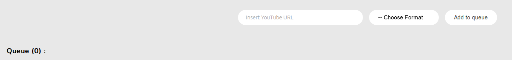

# README

## About

This project is a simple GUI for yt-dlp. It is built using Wails and Svelte.

## Prerequisites

You will need GO 1.16 or later installed. [link here](https://golang.org/doc/install)

And you will need to install the dependencies for yt-dlp and ffmpeg. You can do this by running the following commands :

```bash
sudo apt-get install -y ffmpeg
sudo apt-get install -y yt-dlp
pip install --upgrade --break-system-packages yt-dlp
```

To run the project, you can simply chmod +x the binary file (/build/bin/YoutubeDownloader) and run it.

If you wish to change the code, you will need to install the development environment :

- You will need to have the Wails development environment installed. You can find instructions on how to do this [here](https://wails.io/docs/gettingstarted/installation).

## Live Development

To run in live development mode, run `wails dev` in the project directory. This will run a Vite development
server that will provide very fast hot reload of your frontend changes. If you want to develop in a browser
and have access to your Go methods, there is also a dev server that runs on http://localhost:34115. Connect
to this in your browser, and you can call your Go code from devtools.

## Building

To build a redistributable, production mode package, use `wails build`.

## Showcase


Enter a URL, choose the format (MP4 for video and mp4a for audio) and click on "Add to queue".

This will put the download in the queue and start downloading it. Once its done, the box will be colored blue.